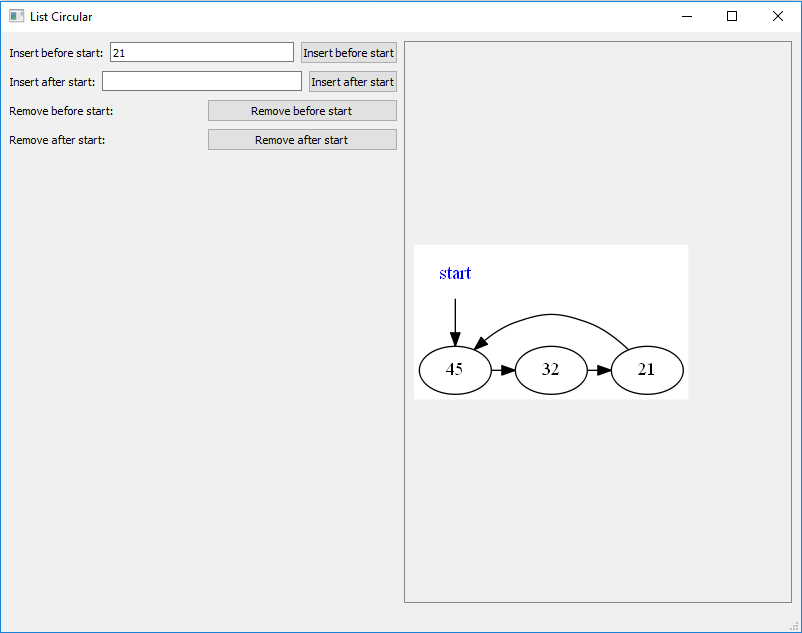

Circular List
====================

This repository has a project with the implementation of a Circular List.

It is written in C++.

The code of the List is independent of platform.

Is has two possible main files:

* [Codes](#markdown-header)
	* [A main that triggers unit test;](#markdown-header-emphasis)

	* [A Qt project to manage the Circular List (With Gui).](#markdown-header-strikethrough)
	
The library used to make the Unit Test is the Catch v2.12.3. The code is already in this repository.

The Qt project generates images of the Circular List, using the lib Graphviz.
Install this lib in your computer for you to be able to create such images.

The code was written containing the Doxygen documentation.

- - -

You have several options to build the project: 
====================

* [Build tools](#markdown-header)
	* [Makefile (using the file named MakefileGeneral);](#markdown-header-emphasis)
	* [CMake.](#markdown-header-emphasis)
	* [Qt Project (With QMake).](#markdown-header-emphasis)

The project has no leaks (Fully tested with Valgrind).

All the unit tests are ok.

- - -

The main functionalities available are: 
====================

* [Functionalities](#markdown-header)
	* [Insert after start;](#markdown-header-emphasis)
	* [Insert before start;](#markdown-header-emphasis)	
	* [Remove after start;](#markdown-header-emphasis)	
	* [Remove before start;](#markdown-header-emphasis)
	
- - -

Sample image: 
====================

Qt gui project: 
====================
The qt gui application gui is shown below:

